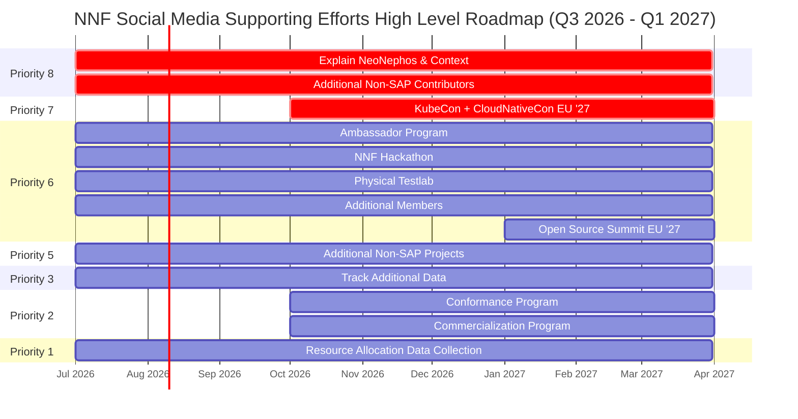
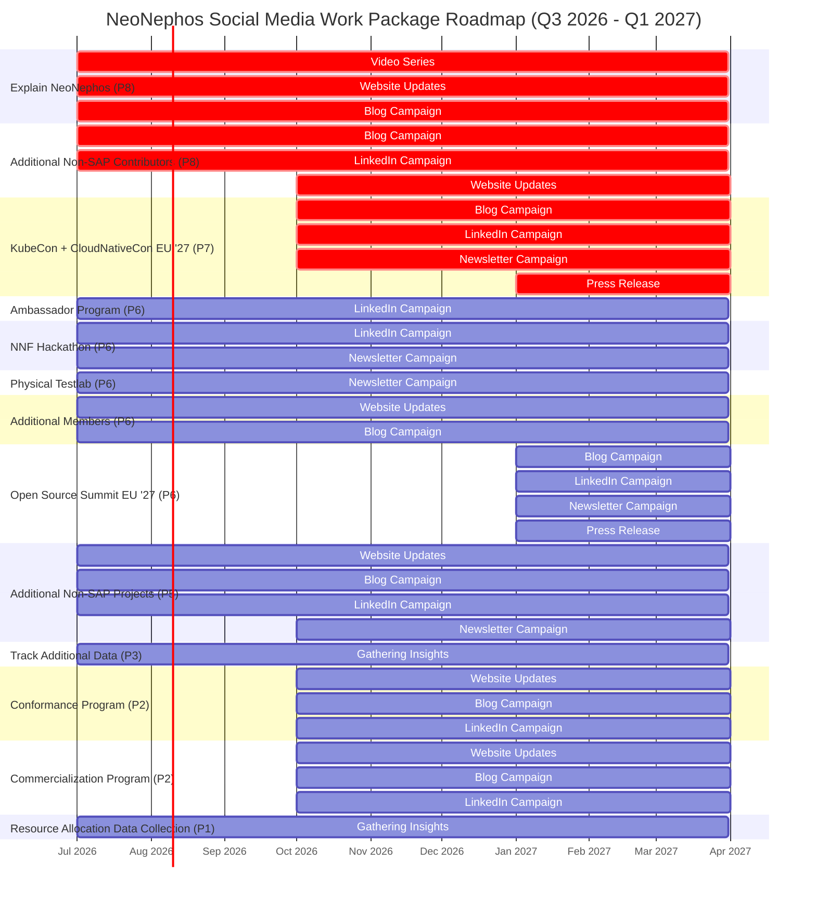

# Social Media Strategy Document

*Approved on _______* by the Outreach Committee Social Media SIG.

> [!NOTE]
> The strategy outlined in this document is valid from ```Q3 2026 – Q1 2027```.

## Table of Contents

- **[Preamble]()**
- **[The Social Media Strategy]()**
  - [Assumptions And Boundary Coundtions]()
   - [These Documents Guide The Social Media Strategy]()
       - [Derived Targets]()
  - [Implementation of the social media strategy]()
  - [Roadmap]()
  - [Conformance Control]()
- **[Appendix]()**


## Preamble

The NeoNephos Social Media Strategy Document ("the Social Media Strategy Document"), as defined in [Social Media Strategy General Conditions & Rules](../social_media.md#social-media-strategy-document), is the primary document describing the NeoNephos Social Media Strategy. 

### Scope

 The [scope](../social_media.md#social-media-strategy-document) for this edition of the document is defined as:

> The Social Media Strategy Document Q3 2026 – Q1 2027 describes the NeoNephos Social Media Strategy for ```Q3 2026 – Q1 2027```. It lays out how social media is used to optimally and measuarbly support the vision set out by the NeoNephos Governing Board for Q3 2026 – Q1 2027 and beyond. 

## The Social Media Strategy

### Assumptions and Boundary Coundtions

To develop a realitic strategy, some constraints are introduced:

|Condition | Limit|Comment |
| --- | ---| ---|
| Available cash for social media efforts | <€50,000 | We limit our strategy to a maximum cost of €50,0000 to the foundation within the timeframe described by this document. |
| Available combined man hours for social media activities from the Social Media SIG | <20 combined man hours / week | We assume a combined maximum of 20 man hours per week amongst Social Media SIG members.|
| Static Roadmap & Vision targets | | We assume the roadmap and vision documents created by the Governing Board will not experience major deviations during the timeframe described by this document. |

### These Documents Guide The Social Media Strategy

The following documents are used as the primary source for establishing the social media strategy:

| Source | Description |
|---|---|
|[NeoNephos Roadmap](https://neonephos.org/blog/20260507_governing_board_workshop)| The NeoNephos Roadmap for ```Q3 2026 – Q1 2027```|
|[NeoNephos Goals](https://neonephos.org/goals)| The goals document describes on a high level what NNF stands for and intends to do |

> [!NOTE]
> The upcoming NeoNephos Vision document was unfinished at the time of this writing and is therefore not considered in the Social Media Strategy for ```Q3 2026 – Q1 2027```.

### Viusal Overview

The following is a visual overview of the granular target description below.

#### General overview


#### Task View Overview




### Social Media Targets

The following social media targets are the main focus areas the social media strategy supports.

> [!NOTE]
> The topics listed below only reference the *primary* focus areas. This does not mean this is the sole social media content to be created.

#### Derived Targets

From the documents mentioned in the prior section these are the targets the social media strategy aims to support:

| Reference | Topic | Source | Priority Weight |
|---|---|---|---|
|#T01 | Ambassador Program | [NeoNephos Roadmap](https://neonephos.org/blog/20260507_governing_board_workshop) |6|
|#T02 | Organize NNF Hackathon | [NeoNephos Roadmap](https://neonephos.org/blog/20260507_governing_board_workshop) |6|
|#T03 | Establish Physical NNF Testlab | [NeoNephos Roadmap](https://neonephos.org/blog/20260507_governing_board_workshop) |6|
|#T04 | Get additional 3+ non-SAP Members | [NeoNephos Roadmap](https://neonephos.org/blog/20260507_governing_board_workshop) |6|
|#T05 | Establish Conformance Program | [NeoNephos Roadmap](https://neonephos.org/blog/20260507_governing_board_workshop) |2|
|#T06 | Establish Commercialization Program | [NeoNephos Roadmap](https://neonephos.org/blog/20260507_governing_board_workshop) |2|
|#T07 | Host Kubecon+CloudNativeCon '27 co-located event | [NeoNephos Roadmap](https://neonephos.org/blog/20260507_governing_board_workshop) |7|
|#T08 | Host Open Source Summit '27 co-located event | [NeoNephos Roadmap](https://neonephos.org/blog/20260507_governing_board_workshop) |6|
|#T09 | Explain NeoNephos and context | [NeoNephos Goals](https://neonephos.org/goals) |8|

#### Additional Targets

These are additional targets that are not mentioned directly in official documentation but have been considered useful from the provided context:

| Reference | Topic | Priority Weight |
|---|---|---|
|#T10 | Get additional 2+ non-SAP projects | 5 |
|#T11 | Get additional non-SAP contributors in projects | 8 |

#### Social Media SIG Targets

These are additional targets that are not mentioned directly in official documentation but have been considered useful from the perspective of the Social Media SIG:

| Reference | Topic | Priority Weight |
|---|---|---|
|#T10 | Track additional data |3|
|#T11 | Collect data to estimate parameters in the resource allocation model |1|

### Detailed Strategy

The following sections lists how the Social Media Strategy supports the general targets laid out earlier.
All Social Media efforts will be directed to support the targets laid out in these documents.

#### Ambassador Program

| How to support | Duration of Social Media Supporting Efforts | Description of Effort | How to measure Success | Success Criteria |
|---|---|---|---|---|
|[LinkedIn Campaign](../social_media_template_work_packages.md#linkedin-campaign)| ```>= Q3 2026``` | Running Topics: (1) How to become an Ambassador (2) News what Ambassadors recently did| LinkedIn Analytics Toolset| An avg. of a link click rate (of a post) of 0.2|

##### Goal

The goal of social media activities with regards to the Ambassador Program is to encourage people to apply for the program.

#### [Organize NNF Hackathon](https://neonephos.org/blog/20260507_governing_board_workshop)

| How to support | Duration of Social Media Supporting Efforts | Description of Effort | How to measure Success | Success Criteria |
|---|---|---|---|---|
|[LinkedIn Campaign](../social_media_template_work_packages.md#linkedin-campaign)| ```>= Q3 2026``` | Running Topics: (1) Promote upcoming hackatons (2) Talk about what happened during the last hackathon | LinkedIn Analytics Toolset| An avg. of a link click rate (of a post) of 0.2|
|[Newsletter E-Mail Campaign](../social_media_template_work_packages.md#newsletter-e-mail-campaign)| ```>= Q3 2026``` | Running Topics: (1) Promote upcoming hackatons (2) Talk about what happened during the last hackathon | Groups.io (or Hubspot) Analytics Toolset| A mail opening rate of 0.3 one week post sendout|

##### Goal

The goal of social media activities with regards to the NNF hackathon is to encourage people to:

- Sign up for the project.
- Let the community know that NeoNephos has physical events.

#### [Establish Physical NNF Testlab](https://neonephos.org/blog/20260507_governing_board_workshop)

| How to support | Duration of Social Media Supporting Efforts | Description of Effort | How to measure Success | Success Criteria |
|---|---|---|---|---|
|[Newsletter E-Mail Campaign](../social_media_template_work_packages.md#newsletter-e-mail-campaign)| ```>= Q3 2026``` | Running Topics: (1) Keep subscribers up-to-date on current effort with regards to the testlab | Groups.io (or Hubspot) Analytics Toolset| A mail opening rate of 0.3 one week post sendout|

##### Goal

The goal of social media activities with regards to the testlab is to:

- Let the world know NNF has a physical presence in the heart of the renowned city of Frankfurt am Main.
    - The advantages of the chosen location must be emphasized. Otherwise, a cheaper server location elsewhere would be seen as more appropriate in the eyes of the public.
- Encourage people to visit the testlab.

#### [Get 3+ additional Non-SAP members](https://neonephos.org/blog/20260507_governing_board_workshop)

| How to support | Duration of Social Media Supporting Efforts | Description of Effort | How to measure Success | Success Criteria |
|---|---|---|---|---|
|[NeoNephos Website Update](../social_media_template_work_packages.md#neonephos-website-page-update)| ```>= Q3 2026``` | Explain the advantages of becoming a member| Existence of page| Existence of pages|
|[Blog Campaign](../social_media_template_work_packages.md#neonephos-blog-campaign)| ```>= Q3 2026``` | Create new blog entries  highlighting testimonials from members | Number of blog case studies | At least 4 case studies |

##### Goal

The goal of social media activities supporting the effort of getting at least three new members is to:

- Inform the public about the advantages of of joining NeoNephos.
- Highlight testimonials from members.

#### [Establish Conformance Program](https://neonephos.org/blog/20260507_governing_board_workshop)

| How to support | Duration of Social Media Supporting Efforts | Description of Effort | How to measure Success | Success Criteria |
|---|---|---|---|---|
|[NeoNephos Website Update](../social_media_template_work_packages.md#neonephos-website-page-update)| ```>= Q4 2026``` | Explain the conformance program| Existence of page| Existence of page|
|[Blog Campaign](../social_media_template_work_packages.md#neonephos-blog-campaign)| ```>= Q4 2026``` | Create a blog entry explaining the conformance program | Number of blog entries | One blog entry |
|[LinkedIn Campaign](../social_media_template_work_packages.md#linkedin-campaign)| ```>= Q4 2026``` | Running Topics: (1) What is the conformance program?| LinkedIn Analytics Toolset| An avg. of a link click rate (of a post) of 0.2|

##### Goal

The goal of social media activities related to this goal is to:

- Inform the public about the existence of the conformance program.
- Inform the public about what the conformance program is.
- Inform the public about the content of the conformance program itself.
- Inform the public how to participate in the development of the program.

It is to be expected that in 2026 the conformance program will not be ready, so any announcements are probably related to its development.

#### [Establish Commercialization Program](https://neonephos.org/blog/20260507_governing_board_workshop)

| How to support | Duration of Social Media Supporting Efforts | Description of Effort | How to measure Success | Success Criteria |
|---|---|---|---|---|
|[NeoNephos Website Update](../social_media_template_work_packages.md#neonephos-website-page-update)| ```>= Q4 2026``` | Explain the conformance program| Existence of page| Existence of page|
|[Blog Campaign](../social_media_template_work_packages.md#neonephos-blog-campaign)| ```>= Q4 2026``` | Create a blog entry explaining the conformance program | Number of blog entries | One blog entry |
|[LinkedIn Campaign](../social_media_template_work_packages.md#linkedin-campaign)| ```>= Q4 2026``` | Running Topics: (1) What is the conformance program?| LinkedIn Analytics Toolset| An avg. of a link click rate (of a post) of 0.2|

##### Goal

The goal of social media activities related to this goal is to:

- Inform the public about the existence of the commercialization working group in order to drive participation.

##### Additional Information

In 2026, it is expected that the commercialization working group is getting started at most. There probably won't be any concrete decisions to talk about.

#### [Host Kubecon+CloudNativeCon '27 co-located event](https://neonephos.org/blog/20260507_governing_board_workshop)

| How to support | Duration of Social Media Supporting Efforts | Description of Effort | How to measure Success | Success Criteria |
|---|---|---|---|---|
|[Blog Campaign](../social_media_template_work_packages.md#neonephos-blog-campaign)| ```Q4 2026 - Q1 2027``` | Create a blog entry around the event | Number of blog entries | At least two blog entries |
|[LinkedIn Campaign](../social_media_template_work_packages.md#linkedin-campaign)| ```Q4 2026 - Q1 2027``` | Running Topics: (1) Our preparations and registration information for our co-located event (2) Promote KubeCon+CloudNativeCon '27 in general| LinkedIn Analytics Toolset| An avg. of a link click rate (of a post) of 0.3|
|[Newsletter E-Mail Campaign](../social_media_template_work_packages.md#newsletter-e-mail-campaign)| ```Q4 2026 - Q1 2027``` | Running Topics: (1) Keep subscribers up-to-date on current NNF KubeCon+CloudNativeCon efforts | Groups.io (or Hubspot) Analytics Toolset| A mail opening rate of 0.3 one week post sendout|
|[Newswire Press Release](../social_media_template_work_packages.md#newswire-press-release)| ```Q1 2027``` | Running Topics: (1) Press release about the NNF co-located event and related news | Linux Foundation Toolset| One press release with more than 500 page views|

##### Goal

The goal of social media activities related to this goal is to:

- Inform the public about:
    - The existence of the NNF co-located event.
    - General NNF participation at the KubeCon+CloudNativeCon EU 27
- Drive registration rates for the NNF co-located event.

#### [Host Open Source Summit '27 co-located event](https://neonephos.org/blog/20260507_governing_board_workshop)

| How to support | Duration of Social Media Supporting Efforts | Description of Effort | How to measure Success | Success Criteria |
|---|---|---|---|---|
|[Blog Campaign](../social_media_template_work_packages.md#neonephos-blog-campaign)| ```>= Q1 2027``` | Create a blog entry around the event | Number of blog entries | At least one blog entry |
|[LinkedIn Campaign](../social_media_template_work_packages.md#linkedin-campaign)| ```>= Q1 2027``` | Running Topics: (1) Our preparations and registration information for our co-located event (2) Promote OSSEU26 in general| LinkedIn Analytics Toolset| An avg. of a link click rate (of a post) of 0.2|
|[Newsletter E-Mail Campaign](../social_media_template_work_packages.md#newsletter-e-mail-campaign)| ```>= Q1 2027``` | Running Topics: (1) Keep subscribers up-to-date on current NNF OSSEU26 efforts | Groups.io (or Hubspot) Analytics Toolset| A mail opening rate of 0.3 one week post sendout|
|[Newswire Press Release](../social_media_template_work_packages.md#newswire-press-release)| ```>= Q1 2027``` | Running Topics: (1) Press release about the NNF co-located event and related news | Linux Foundation Toolset| One press release with more than 500 page views|

##### Goal

The goal of social media activities related to this goal is to:

- Inform the public about:
    - The existence of the NNF co-located event.
    - General NNF participation at the Open Source Summit EU 27
- Drive registration rates for the NNF co-located event.

#### [Explain NeoNephos and context](https://neonephos.org/goals)

| How to support | Duration of Social Media Supporting Efforts | Description of Effort | How to measure Success | Success Criteria |
|---|---|---|---|---|
|[Video Series](../social_media_template_work_packages.md#video-series)| ```>= Q3 2026``` | Running Topics: (1) Explain the background (2) Explain IPCEI-CIS (3) Explain NeoNephos | YouTube Analytics Toolset| An avg. of 100 views per video|
|[NeoNephos Website Update](../social_media_template_work_packages.md#neonephos-website-page-update)| ```>= Q3 2026``` | Create new pages | Existence of page| Existence of pages|
|[Blog Campaign](../social_media_template_work_packages.md#neonephos-blog-campaign)| ```>= Q3 2026``` | Create new blog entries explaining NeoNephos and its background | Existence of page | Existence of pages |

##### Goal

The goal of social media activities related to this goal is to:

- Explain NeoNephos and its context:
    - What is IPCEI-CIS?
    - Why was LFEU chosen as host for NNF?
    - What is Apeiro?
    - How does NNF compare with other initiatives?
    - How does NNF fit into the political landscape like IPCEI-AI, European Tech Sovereignty Package etc.?
- **Reinforce the perception that NeoNephos' history and goals are closely aligned with some initiatives like the European Tech Sovereignty Package.**

#### Get additional 2+ non-SAP projects

| How to support | Duration of Social Media Supporting Efforts | Description of Effort | How to measure Success | Success Criteria |
|---|---|---|---|---|
|[Blog Campaign](../social_media_template_work_packages.md#neonephos-blog-campaign)| ```>= Q3 2026``` | Create a blog entry around the event | Number of blog entries | At least one blog entry |
|[LinkedIn Campaign](../social_media_template_work_packages.md#linkedin-campaign)| ```>= Q3 2026``` | Running Topics: (1) Reiterating our message and call for new projects (2) Highlighting the benefits NNF provides to projects| LinkedIn Analytics Toolset| An avg. of a link click rate (of a post) of 0.2|
|[Newsletter E-Mail Campaign](../social_media_template_work_packages.md#newsletter-e-mail-campaign)| ```>= Q4 2026``` | Running Topics: (1) Highlighting the benefits NNF provides its projects | Groups.io (or Hubspot) Analytics Toolset| A mail opening rate of 0.2 one week post sendout|
|[NeoNephos Website Update](../social_media_template_work_packages.md#neonephos-website-page-update)| ```>= Q3 2026``` | Explain the benefits new projects receive better| Existence of page| Existence of pages|

##### Goal

To reach the aspirational targets set in the [goals document](https://neonephos.org/blog/20260507_governing_board_workshop), the Social Media SIG has decided that an increase in new projects with non-SAP drivers is needed.

The goal of social media activities related to this goal is to:

- Inform the public about:
    - What benefits NNF offers to them for their project
- Increase participation in the form of:
    - New non-SAP projects

#### Get additional non-SAP contributors in projects

| How to support | Duration of Social Media Supporting Efforts | Description of Effort | How to measure Success | Success Criteria |
|---|---|---|---|---|
|[Blog Campaign](../social_media_template_work_packages.md#neonephos-blog-campaign)| ```>= Q3 2026``` | Create a blog entry around the event | Number of blog entries | At least one blog entry |
|[LinkedIn Campaign](../social_media_template_work_packages.md#linkedin-campaign)| ```>= Q3 2026``` | Running Topics: (1) Project news (2) Case studies and successes in our existing projects | LinkedIn Analytics Toolset| An avg. of a link click rate (of a post) of 0.2|
|[NeoNephos Website Update](../social_media_template_work_packages.md#neonephos-website-page-update)| ```>= Q4 2026``` | Explain how to join projects better| Existence of page| Existence of pages|

##### Goal

To reach the aspirational targets set in the [goals document](https://neonephos.org/blog/20260507_governing_board_workshop), the Social Media SIG has decided that an increase in projects with non-SAP drivers is needed.

The goal of social media activities related to this goal is to:

- Inform the public about:
    - How to contribute to our projects.
    - Case studies and successes.
- Increase participation in the form of:
    - More non-SAP contributors in NNF's legacy projects

#### Track additional data

##### Goal

This is an ongoing internal goal which consists of:

- Determining key metrics to track.
- Tracking these metrics.

#### Collect data to estimate parameters in the resource allocation model

This is an internal goal with low priority. Additional description may be provided.

## Conformance Control

### Review Meetings

In accordance to [Social Media Strategy General Conditions & Rules](../social_media.md#social-media-strategy-document), the required Review Meeting is held monthly as part of the [Social Media SIG meeting](https://github.com/neonephos/outreach/tree/outreach-committee-playbook/topics/social_media).

At a minimum, it consists of:

* An overview on the current progress made with respect to the Social Media roadmap.

### Review Tooling
